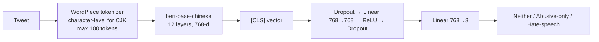

# Chinese Hate Speech Classification

[](https://github.com/chingachleung/ChineseHateSpeechClassification/actions/workflows/ci.yml)


Fine-tuning [`bert-base-chinese`](https://huggingface.co/bert-base-chinese) to classify Chinese
social-media posts into three classes — **Hate-speech**, **Abusive-only**, or **Neither** — on a
self-collected, annotated corpus of ~9,000 tweets written in Simplified Chinese,
Traditional Chinese and Cantonese.

This is the neural follow-up to my [feature-engineering baseline](https://github.com/chingachleung/Chinese_Hate_Speech-Baseline-)
(lexicon, sentiment and embedding-cluster features + logistic regression), built during my
M.S. in Computational Linguistics at Georgetown University.

## Why this problem is hard

- **Hate vs. merely abusive.** Profanity is common in both classes. The model has to decide
  whether an insult *targets a group* (hate speech) or is just rude (abusive-only). That is
  the distinction most English benchmarks collapse into a single "toxic" label.
- **Mixed scripts and varieties.** Simplified, Traditional and written Cantonese appear in
  the same corpus, often in the same tweet, with Cantonese-specific particles and slurs that
  Mandarin-centric resources miss.
- **Coded and ambiguous terms.** Many slurs are homophones, character substitutions or
  terms whose meaning depends on context (the same word may be quoted, reclaimed or used as
  an attack).
- **Class imbalance.** Most keyword-retrieved tweets are neither hateful nor abusive.

## Approach



| Component | Choice | Rationale |
|---|---|---|
| Encoder | `bert-base-chinese` | Pre-trained on Chinese Wikipedia (Simplified + Traditional); character-level tokenisation copes well with mixed scripts and non-standard spellings. |
| Head | 2-layer MLP on `[CLS]` | Adds some non-linear capacity over a single linear probe for a modest parameter cost. |
| Loss | Class-weighted cross-entropy, `w_c = sqrt(n_min / n_c)` | Counters class imbalance. The square root is a gentler correction than plain inverse frequency, which can push the model to over-predict the rare classes. |
| Optimiser | AdamW, lr 1e-5, linear warmup (10%) + decay, grad-clip 1.0 | Standard, stable recipe for BERT fine-tuning. |
| Model selection | Early stopping on **validation macro-F1** (patience 2) | Accuracy and micro-F1 reward predicting the majority class; macro-F1 weights all three classes equally. |
| Continued fine-tuning | `--init-from` + optional `--freeze-encoder` / `--reset-head` | Adapt a trained model to a new domain or label set by training only the head. |

## Results

| Model | Test macro-F1 | Hate-speech F1 | Abusive-only F1 | Neither F1 |
|---|---|---|---|---|
| Feature-based logistic regression ([baseline](https://github.com/chingachleung/Chinese_Hate_Speech-Baseline-)) | — | 0.506 * | — | — |
| **Fine-tuned `bert-base-chinese` (this repo)** | 0.89* | 0.88* | 0.93** | 0.95** |

\* The baseline reported precision 0.569 / recall 0.456 / F1 0.506 for the hate-speech class.

Running `zh-hate evaluate` writes the full per-class report to `test_metrics.json` and a
row-normalised confusion matrix to `confusion_matrix.png`.

## Quickstart

```bash
git clone https://github.com/chingachleung/ChineseHateSpeechClassification.git
cd ChineseHateSpeechClassification
python -m venv .venv && source .venv/bin/activate
pip install -e ".[dev]"
```

Data goes in `data/` as CSVs with `Tweet` and `Label` columns (see [`data/README.md`](data/README.md)).

**Train**

```bash
zh-hate train --train-file data/train.csv --val-file data/val.csv --output-dir runs/bert
# any hyperparameter can be overridden, e.g. --epochs 5 --batch-size 32 --class-weighting inverse
```

**Evaluate**

```bash
zh-hate evaluate --model-dir runs/bert --test-file data/test.csv
```

**Predict**

```bash
zh-hate predict --model-dir runs/bert --text "今天天氣真好" "另一條推文"
# {"text": "今天天氣真好", "label": "Neither", "confidence": 0.97}
```

**Continue fine-tuning on new data (encoder frozen, fresh head)**

```bash
zh-hate train --init-from runs/bert --freeze-encoder --reset-head \
  --train-file data/new_train.csv --val-file data/new_val.csv --output-dir runs/bert-adapted
```

Each run directory is self-contained (weights, tokenizer, encoder config, hyperparameters,
per-epoch history and training curves), so it can be reloaded offline.

## Project structure

```
├── src/zh_hate_speech/
│   ├── config.py      # label schema + TrainConfig dataclass (all hyperparameters)
│   ├── data.py        # CSV loading/validation, Dataset, class weighting
│   ├── model.py       # BERT encoder + MLP classification head
│   ├── engine.py      # training loop, evaluation, early stopping, checkpoint I/O
│   ├── reporting.py   # classification report, confusion matrix, training curves
│   └── cli.py         # `zh-hate train | evaluate | predict`
├── tests/             # pytest suite; builds a tiny BERT locally, no downloads
├── data/              # data format docs + example (real data not redistributed)
└── .github/workflows/ # lint + tests on every push
```

## Testing

```bash
pytest -q        # ~3 s on CPU
ruff check .
```

The tests build a 2-layer, 32-dim BERT with a toy vocabulary, so they cover the full
train → checkpoint → reload → evaluate → predict path in seconds and without network access.

## Data and ethics

The corpus was collected through the Twitter API with a hand-built lexicon of Chinese slurs
and hate-speech keywords, then manually annotated. **It is not redistributed**, to
respect platform terms and the privacy of the users quoted. Keyword-based retrieval
over-represents explicit slurs, so the model is likely weaker on implicit or coded hate
speech. It should support human moderation, not replace it.

## Limitations and next steps

- No inter-annotator agreement is reported. A second annotation pass would quantify label
  noise, especially on the hate/abusive boundary.
- Try Chinese-specific encoders (`hfl/chinese-roberta-wwm-ext`, `hfl/chinese-macbert-base`)
  and a Cantonese-adapted model.
- Normalise script (Traditional ↔ Simplified) as an augmentation, and test for robustness
  to homophone and character substitutions.
- Calibrate confidence scores and choose per-class thresholds for moderation use.

## Author

**Wai Ching Leung** — ML Engineer (NLU/NLP, LLM pipelines) · [GitHub](https://github.com/chingachleung)

Related: [Chinese Hate Speech — feature-based baseline](https://github.com/chingachleung/Chinese_Hate_Speech-Baseline-)
